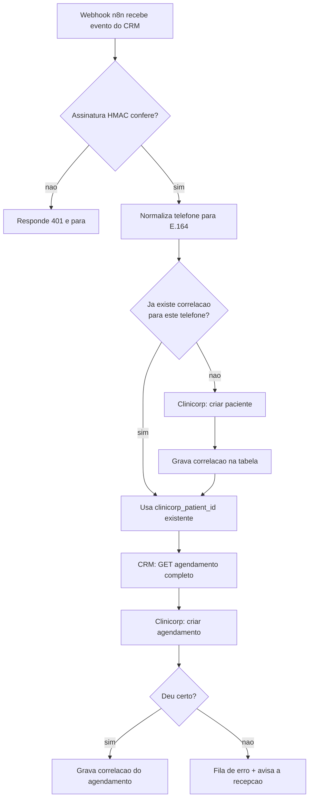
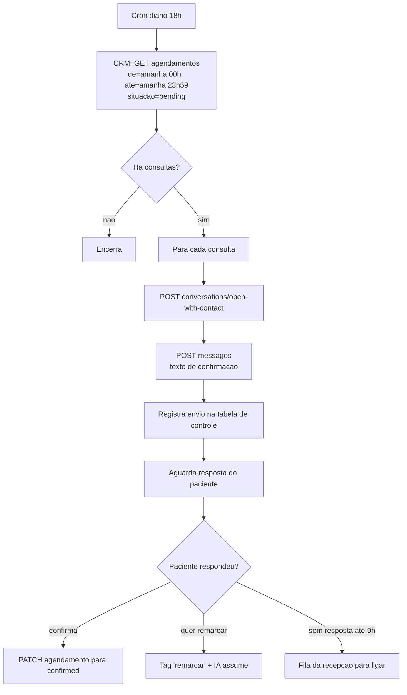

# Integração Clinicorp e o lembrete D-1

> Tudo aqui é **degrau 2 da escada**: integração por fora, zero linha no core. A cola é o n8n, que já está
> no seu stack.
>
> Dois entregáveis: o espelho CRM ↔ Clinicorp (RF-08) e o **lembrete de consulta em D-1** (RF-05), que é a
> lacuna que o estudo encontrou e que o n8n resolve.

---

## 1. Credenciais e pré-requisitos

### Clinicorp

| Item | Valor |
|---|---|
| Base | `https://api.clinicorp.com/rest/v1` |
| Autenticação | HTTP Basic — usuário API `:` token API |
| Documentação | Swagger em `https://sistema.clinicorp.com/api-docs/` |
| Onde gerar | Gerenciar Assinatura → Acesso Externo e Integrações |
| Também obrigatório | **Subscriber ID** e **ID da clínica** — este último só pelo suporte do Clinicorp |

Existe o node community `n8n-nodes-clinicorp` (17 recursos, ~49 operações), com teste embutido de
credencial que chama `GET /professional/list_all_professionals`. **Valide a credencial por ele antes de
montar qualquer fluxo.**

> 🔴 **O escopo do token é negociado na contratação.** Nem todo dado fica exposto por padrão. Antes de
> prometer qualquer campo à clínica, liste o que o token realmente alcança. Prometer e não entregar aqui
> queima a integração inteira.

### CRM

Gere um token em `/app/settings/api-tokens` (admin). Uso: `Authorization: Bearer tok_...`.
**Um token por clínica** — nunca um token compartilhado entre organizações, porque ele resolve a
organização ativa e é o que mantém o isolamento.

Rotas que os fluxos usam:

| Rota | Uso |
|---|---|
| `GET /api/v1/agenda/agendamentos` | listar consultas — aceita `de`, `ate`, `dia`, `situacao`, `owner_user_id`, `contact_id`, `lead_id`, `limite` (máx. 500) |
| `GET /api/v1/contacts/{id}` | dados do paciente |
| `POST /api/v1/conversations/open-with-contact` | abrir ou recuperar a conversa do contato |
| `POST /api/v1/conversations/{id}/messages` | enviar a mensagem pelo WhatsApp da clínica |
| `PATCH /api/v1/agenda/agendamentos/{id}` | confirmar ou cancelar |

---

## 2. A regra que evita o desastre: quem é dono de quê

> **O CRM é dono do comercial. O Clinicorp é dono do clínico e do financeiro. Nenhuma entidade tem dois donos.**

| Entidade | Fonte da verdade | Direção |
|---|---|---|
| Conversa, lead, etapa do funil | CRM | não sai |
| Paciente (cadastro básico) | CRM na criação; Clinicorp depois | CRM → Clinicorp, **uma vez** |
| Agendamento | CRM na marcação; Clinicorp depois | CRM → Clinicorp; status volta |
| Orçamento, procedimento, financeiro | Clinicorp | Clinicorp → CRM, somente leitura |
| Prontuário | Clinicorp | **não entra no CRM** |

Escrever nos dois lados a mesma entidade produz divergência silenciosa: ninguém percebe até a recepção ver
dois horários diferentes para o mesmo paciente e perder a confiança nos dois sistemas ao mesmo tempo.

---

## 3. As limitações conhecidas, e como contorná-las

**A ação de cadastrar lead no Clinicorp não deduplica e não move o lead entre etapas.**

Consequências práticas:

1. **A deduplicação é sua, no n8n.** Chave: telefone normalizado em E.164. Mantenha uma tabela de
   correlação — Supabase, Postgres do n8n, ou o que preferir:

   ```
   crm_contact_id | clinicorp_patient_id | telefone_e164 | criado_em
   ```

2. **Escreva no Clinicorp uma única vez por paciente.** Antes de qualquer criação, consulte a tabela. Se já
   houver correlação, siga para o agendamento sem recriar o paciente.

3. **Não use o funil de CRM do Clinicorp.** Ele não move etapas pela API, e o funil já vive no nosso CRM.
   Dois funis é pior que um.

---

## 4. Fluxo C-01 · Paciente e consulta vão para o Clinicorp

**Disparo:** automação A-05 do CRM (`lead.stage_changed` para "Consulta marcada") chamando
`call_webhook` no n8n.



### Detalhes que não podem faltar

**Valide o HMAC.** O CRM assina o corpo com `X-Deskcomm-Signature` (HMAC-SHA256) quando você configura o
`secret` na ação. Sem validar, seu endpoint aceita qualquer POST da internet.

**Idempotência no n8n.** O CRM tenta 3 vezes (1s e 5s de intervalo) em caso de falha. Se a primeira
tentativa criou o paciente e só a resposta se perdeu, a segunda cria duplicata. Use o `event.id` ou a
combinação `lead_id + occurred_at` como chave de execução única.

**Fila de erro visível.** Falha silenciosa aqui significa consulta que existe no CRM e não existe no
Clinicorp — e a clínica descobre com o paciente na recepção. Erro tem de virar aviso para alguém.

---

## 5. Fluxo C-02 · Status volta do Clinicorp

**Disparo:** agendado no n8n, a cada 15 minutos.

Lê os agendamentos do dia no Clinicorp e reconcilia com o CRM:

| Situação no Clinicorp | Ação no CRM |
|---|---|
| Confirmado | `PATCH` para `confirmed` |
| Cancelado | `PATCH` para `cancelled` com motivo |
| Atendido | `PATCH` para `completed` |
| Faltou | `PATCH` para `no_show` — **dispara o fluxo F-02 de recuperação** |

> **Só escreva quando o status realmente mudou.** Escrever o mesmo valor gera atividade na timeline do lead
> e polui o histórico que a recepção lê. Compare antes.

Se a clínica preferir marcar presença pelo próprio CRM, este fluxo vira somente leitura. Decida com ela na
primeira semana — o importante é que **um dos dois lados seja o dono da presença**, não os dois.

---

## 6. 🔴 Fluxo C-03 · Lembrete e confirmação em D-1

**Este fluxo existe porque o produto não tem o mecanismo.** Medido: `reminder_enabled` e
`reminder_minutes_before` existem em `calendar_event_types` e têm zero leitores; não há cron de lembrete
entre os 15 do `scheduler`; e nenhum dos 5 gatilhos de automação é de agendamento. Prova em
[`01-mapa-de-configuracao.md`](01-mapa-de-configuracao.md) §5.

**Disparo:** agendado, todo dia às 18h, no fuso da clínica.



### A chamada que lista as consultas de amanhã

```bash
curl -s -G "https://<dominio>/api/v1/agenda/agendamentos" \
  -H "Authorization: Bearer tok_..." \
  --data-urlencode "de=2026-09-11T00:00:00-03:00" \
  --data-urlencode "ate=2026-09-11T23:59:59-03:00" \
  --data-urlencode "situacao=pending" \
  --data-urlencode "limite=500"
```

### O texto

```
Oi {primeiro_nome}! Passando pra confirmar sua consulta
amanhã ({dia}/{mês}) às {hora}, com {profissional}, na {clínica}.

Responda *SIM* para confirmar ou *REMARCAR* se precisar mudar o horário.
```

Curto, com a informação toda na primeira linha, e com uma pergunta só. Lembrete que faz duas perguntas
recebe zero resposta.

### As cinco regras que fazem este fluxo não virar um problema

1. **Só `situacao=pending`.** Quem já está `confirmed` não recebe. Mandar duas vezes é o caminho mais curto
   para o bloqueio.
2. **Uma mensagem por consulta, sempre.** Tabela de controle com `appointment_id + data_envio` como chave
   única. Rodar o fluxo duas vezes por engano não pode enviar duas vezes.
3. **Respeite a janela de horário.** Nada depois das 20h nem antes das 8h. O anti-banimento do CRM protege
   o envio pelo canal, mas o incômodo do paciente é problema de reputação da clínica.
4. **Sem resposta não é falta.** Vira ligação da recepção às 9h do dia seguinte, não cancelamento
   automático.
5. **Segure a mão em procedimento caro.** Endodontia e implante merecem ligação, não mensagem. Filtre por
   `event_type_id` e mande esses para a fila da recepção.

### Por que isso vale um PR upstream, depois

O schema já está pronto esperando o disparador. A migration `0194_lembrete_nasce_desligado` existe
justamente para desligar o default *antes* que alguém escreva o cron — e diz, com todas as letras, que
"ligar lembrete por padrão fica com o dono do produto no dia em que o disparador nascer".

É o convite mais explícito que um repositório open source faz. E serve **todo o vertical de clínicas**, que
é justamente o público que a comunidade trouxe para o projeto. Contribuir isto vale mais que qualquer
feature própria que possamos escrever.

**Ordem certa:** faça funcionar no n8n primeiro, com clínica real e número real. Um PR escrito sobre
comportamento medido em produção entra; um escrito sobre suposição, não.

---

## 7. Fluxo C-04 · Recall semestral

**Disparo:** semanal.

Lê no Clinicorp os pacientes cuja última profilaxia foi há 6 meses ou mais, filtra quem não tem consulta
futura, e dispara o fluxo **F-03** do CRM por `webhook`.

```
Clinicorp: pacientes com ultima_profilaxia <= hoje - 180 dias
  → excluir quem tem consulta futura (CRM: GET agendamentos, de=hoje)
  → excluir quem não consente WhatsApp (contact.custom_fields.consente_whatsapp)
  → excluir quem já entrou no recall nos últimos 90 dias
  → CRM: adicionar tag 'recall-6m'  → dispara F-03
```

**Limite de volume:** no máximo 30 por dia, por clínica. Disparar 400 recalls numa manhã é o perfil exato
de comportamento que faz um número ser banido — e o número é da clínica.

> Este é o fluxo de maior retorno financeiro do conjunto. Base inativa é o ativo mais desperdiçado numa
> clínica odontológica, e aqui o motor de follow-up já está pronto do lado do CRM.

---

## 8. Ordem de implantação

Não faça os quatro de uma vez. Cada um precisa de uma semana de observação.

| Ordem | Fluxo | Por quê primeiro | Pré-requisito |
|---|---|---|---|
| 1 | **C-03 · lembrete D-1** | maior impacto, **não depende do Clinicorp** | só token do CRM |
| 2 | C-01 · paciente e consulta → Clinicorp | tira digitação dupla da recepção | credenciais Clinicorp validadas |
| 3 | C-02 · status ← Clinicorp | fecha o ciclo de presença | C-01 estável |
| 4 | C-04 · recall semestral | maior retorno, maior risco de banimento | número aquecido, C-02 alimentando dados |

**O C-03 entra no piloto.** Os outros três esperam a integração com o Clinicorp estar contratada e o escopo
do token confirmado.

---

## 9. O que ainda não foi validado

Honestidade sobre os limites deste documento:

- **Nenhuma chamada ao Clinicorp foi executada.** Não há credenciais. Os nomes de recurso vêm da
  documentação do node n8n e do Swagger público, não de resposta real.
- **O escopo do token da clínica-piloto é desconhecido** e pode não cobrir tudo que os fluxos pedem.
- **Não se sabe se o Clinicorp emite webhook** para os eventos que interessam. Se emitir, o C-02 deixa de
  ser consulta a cada 15 minutos e vira evento — melhor em todos os aspectos. **Pergunte ao suporte deles.**
- **Os fluxos n8n não foram construídos**, só especificados. A construção é rápida; a validação com dado
  real é o que leva tempo.
